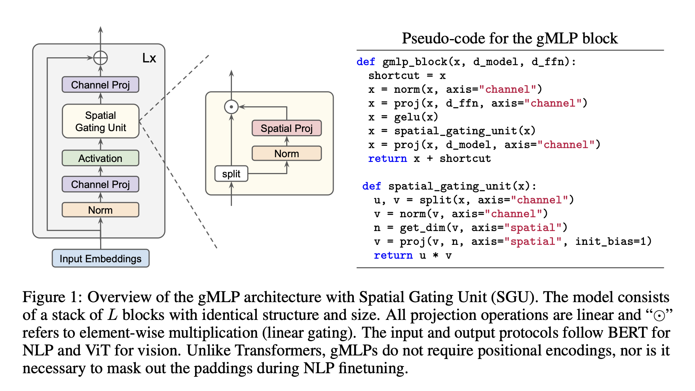
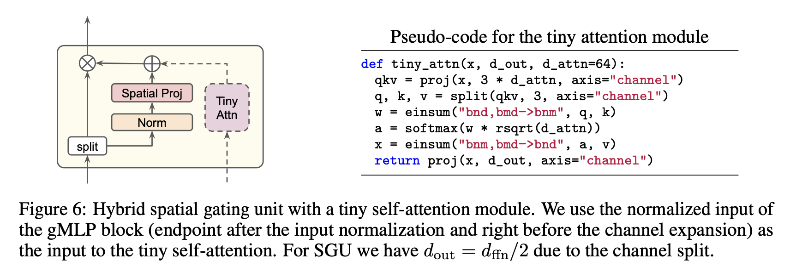

# gMLP Jax

gMLPs with Spatial Gating Units in Jax (Flax).

Flax linen API maps pretty much 1:1 with pseudocode in the paper.




## Usage
```python
import jax
import jax.numpy as jnp
from gmlp import gMLP

rng = jax.random.PRNGKey(42)
model = gMLP(512, attn_features=64)
out, params = model.init_with_output(rng, jnp.zeros((1, 128, 320)))
jax.tree_map(jnp.shape, params)
```

